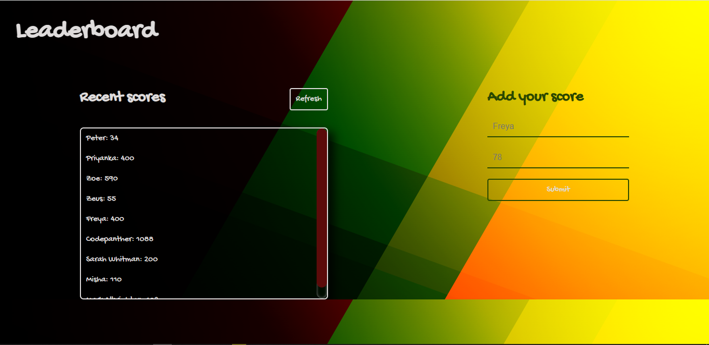

# leaderboard
> The leaderboard website displays scores submitted by different players. It also allows you to submit your score. All data is preserved thanks to the external Leaderboard API service.

## Built With

- HTML
- CSS
- JAVASCRIPT

## Live Demo 🔗

[Live Demo Link](https://codepantherr.github.io/leaderboard/)

## Getting Started
To get a local copy up and running follow these simple example steps.

### Setup

To setup the leaderboard app project starting template in your local, in the repo page:
click on code (dropdown list) > Download as ZIP.
or open terminal and go to the path you want to install project and run this command  
`git clone https://github.com/codepantherr/leaderboard.git`

### Deployment

To run the project open folder (after extraction) or cloning then run these commands:  
**`npm install`** to install all dependencies  
**`npm start`** to start the application, you should see the application working at: `http://localhost:8080/`

## Authors

👤 **Author**

- GitHub: [@Code-panther](https://github.com/Code-panther)
- Twitter: [@codepantherr](https://twitter.com/codepantherr)
- LinkedIn: [promise-eze](https://linkedin.com/in/promise-eze)

## 🤝 Contributing

Contributions, issues, and feature requests are welcome!

Feel free to check the [issues page](../../issues/).

## Show your support

Give a ⭐️ if you like this project!

## Acknowledgments

- Hat tip to anyone whose code was used
- Inspiration
- etc

## 📝 License

This project is [MIT](./MIT.md) licensed.